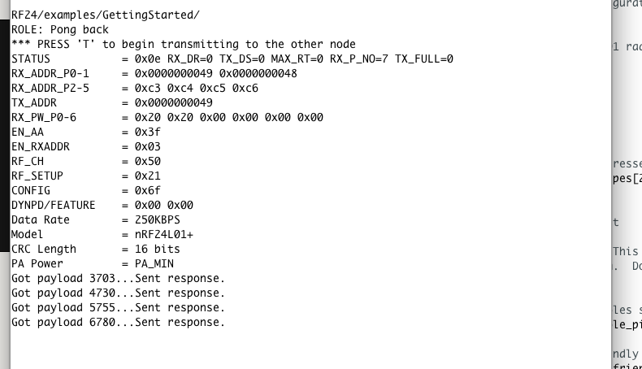
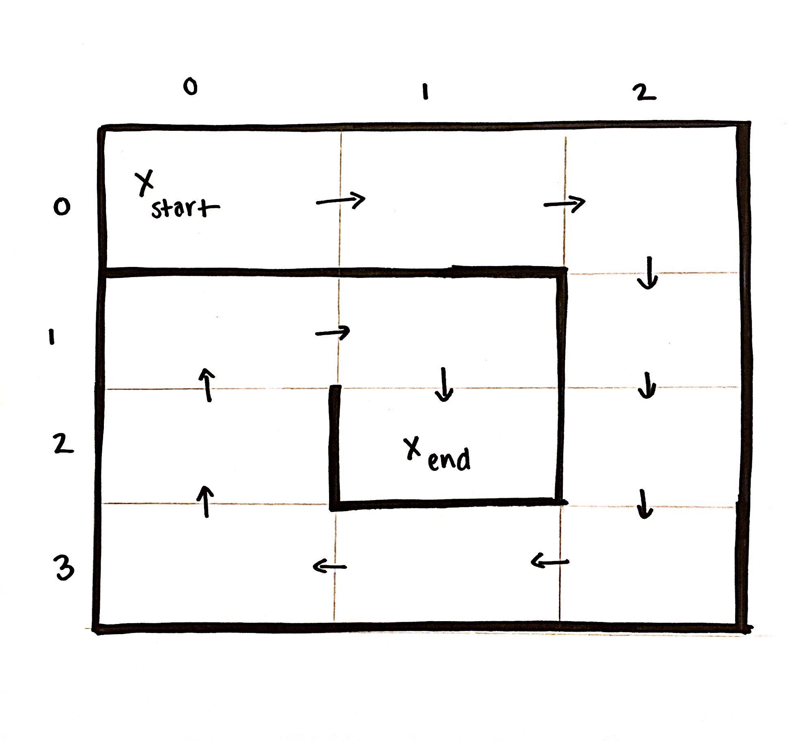
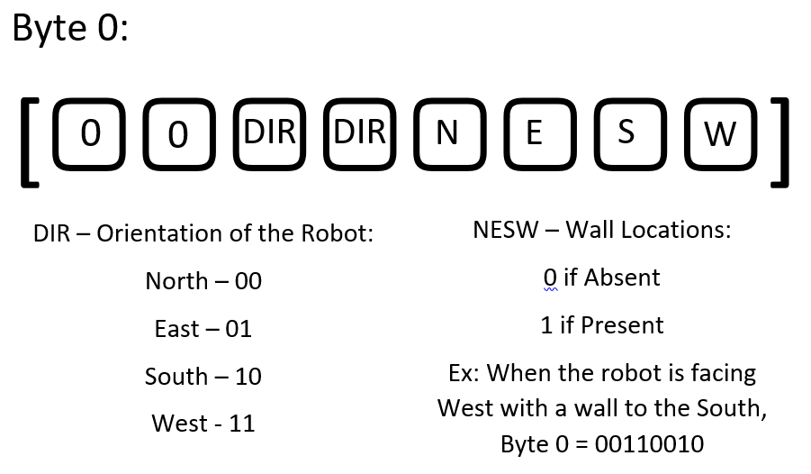

# Lab 3
[Home](./index.md)

Materials:  
  * Arduino Uno (2)
  * Nordic nRF24L01+ transceiver (2)
  * 2 Breakout Boards w/ Headers
  * Electret microphone
  * Phototransistor
  
The purpose of this lab is to integrate the individual components completed in the previous labs and milestones. The objectives of this milestone are as follows:

 * Have the robot navigate a small maze and map the maze by wirelessly communicating to a base station
 * Integrate the microphone circuit from Lab 2 to start the robot on a 660 Hz tone
 * Successfully avoiding other robots while ignoring decoys

## Testing the Radios:

We began ensuring the functionality of the RF24 transceivers by running the provided Getting Started sketch.  This sketch ensures that the transceivers are able to pass a timestamp to each other and print it to the Serial Monitor. Screenshots of this process are shown below:

## Encoding the Maze and Updating the GUI:

We created the below 4X3 maze to demonstrate our robot's new capabilities:

Since the maximum payload for the transceivers is 32 bytes, we decided that a 3 byte encoding scheme would be efficient without restricting the base station's ability to interpret and process accurate information. We decided to package our information payload in a byte array, since the first byte is related specifically to wall information, while the last two bytes will be related to treasure information. A diagram of the encoding scheme of the first byte is shown below:

These payloads are transferred each time the robot enters a new square, and stored on the base station in a 9X9 2D array.  Despite the actual starting location of the robot, the GUI is updated and information is handled such that the robot begins in the 'Northwest' corner of the map, facing 'East'.  It is understood that the directions are ordinal, and do not have any relation to the Cardinal directions of the same names.

## Transmission

The transmission code is shown below. In our simulated version, the only change was that the data we send is a predetermined byte array that follows our encoding scheme for our sample maze. The encodings for our test maze are shown below:
~~~c
byte wall_encodings[12][3] = { {0b00011011, 0, 0},
  {0b10011010, 0, 0}, {0b00101100, 0, 0}, {0b10100101, 0, 0}, {0b00100101, 0, 0}, {0b10110110, 0, 0}, {0b00111010, 0, 0},
  {0b10000011, 0, 0}, {0b00000101, 0, 0}, {0b10011001, 0, 0}, {0b00101100, 0, 0}, {0b10000111, 0, 0} } ;
~~~

Our transmission code is shown below:

~~~c
void radio_transmit() {
  // First, stop listening so we can talk.
  byte info[3] = {0, 0, 0};   //stores maze info.
  info[0] = pack_bit_one(dir_old);
  radio.stopListening();

  if (role == role_ping_out) {
    radio.stopListening();
    radio.openWritingPipe(pipes[0]);
    servoL.write(90);
    servoR.write(90);
    bool ok = radio.write( info, sizeof(info) );

    radio.startListening();

    if (!ok) {
      radio.stopListening();
      bool ok = radio.write(info, sizeof(info));
    }
    radio.startListening();
    drive_straight();
  }
}
~~~

The specific data that we are sending is written into this 3 byte array using the following helper functions. The two functions below update the direction that the robot is facing to be entered into our byte array, and the base station will use this information to calculate the correct coordinates of the robot on the maze GUI. A specific case for our turn-around function is used based on the fact that the end direction will be the exact opposite of the starting direction.

~~~c
void update_direction(int facing, int turn_dir) {
    dir_old = dir;
    if (facing == 0) {//ROBOT IS FACING NORTH
      if (turn_dir == 0) { // if robot is turning right
        dir = 1;
      }
      else {               // if robot is turning left
        dir = 3;
      }
    }
    if (facing == 1) {//ROBOT IS FACING EAST
      if (turn_dir == 0) { // if robot is turning right
        dir = 2;
      }
      else {               // if robot is turning left
        dir = 0;
      }
    }
    if (facing == 2) {//ROBOT IS FACING SOUTH
      if (turn_dir == 0) { // if robot is turning right
        dir = 3;
      }
      else {               // if robot is turning left
        dir = 1;
      }
    }
    if (facing == 3) {//ROBOT IS FACING WEST
      if (turn_dir == 0) { // if robot is turning right
        dir = 0;
      }
      else {               // if robot is turning left
        dir = 2;
      }
    }
}
void update_direction_turn_around() {
  dir_old = dir;
  if (dir == 0) {
    dir = 2;
  }
  if (dir == 1) {
    dir = 3;
  }
  if (dir == 2) {
    dir = 0;
  }
  if (dir == 3) {
    dir = 1;
  }
}
~~~

The helper function below writes the correct values based on logic and sensor readings to the byte array being transmitted to the base station:
~~~c
byte pack_bit_one(int facing) {
  byte info = 0;
  int n = 0;
  int e = 0;
  int s = 0;
  int w = 0;
  int lwall = 0;
  int rwall = 0;
  int fwall = 0;
  if (left_wall_value > wall_threshold) {
    lwall = 1;
  }
  if (front_wall_value > wall_threshold) {
    fwall = 1;
  }
  if (right_wall_value > wall_threshold) {
    rwall = 1;
  }
  if (facing == 0) {//ROBOT IS FACING NORTH
      w = lwall;
      n = fwall;
      e = rwall;
  }
  if (facing == 1) {//ROBOT IS FACING EAST
      n = lwall;
      e = fwall;
      s = rwall;
  }
  if (facing == 2){//ROBOT IS FACING SOUTH
      e = lwall;
      s = fwall;
      w = rwall;
  }
  if (facing == 3){//ROBOT IS FACING WEST
      s = lwall;
      w = fwall;
      n = rwall;
  }
  if (dir == 0) {
      bitWrite(info, 4, 0);
      bitWrite(info, 5, 0);
  }
  if (dir == 1) {
      bitWrite(info, 4, 1);
      bitWrite(info, 5, 0);
  }
  if (dir == 2) {
      bitWrite(info, 4, 0);
      bitWrite(info, 5, 1);
  }
  if (dir == 3) {
      bitWrite(info, 4, 1);
      bitWrite(info, 5, 1);
  }
  bitWrite(info, 0, w);
  bitWrite(info, 1, s);
  bitWrite(info, 2, e);
  bitWrite(info, 3, n);
  
  return info;

}
~~~

## Receiving
The receiving code is shown below:
~~~ c
void setup() {
  Serial.begin(9600);
  printf_begin();
  radio.begin();
  radio.setRetries(15,15);
  radio.setAutoAck(true);
  radio.setChannel(0x50);
  radio.setPALevel(RF24_PA_MIN);
  radio.setDataRate(RF24_250KBPS);
  
  radio.openWritingPipe(pipes[1]);
  radio.openReadingPipe(1,pipes[0]);    

  radio.startListening();
}
void loop() {
  // put your main code here, to run repeatedly:
    if ( radio.available() ) {
      bool done = false;
      while (!done) {
        done=radio.read(&data,sizeof(data));
        if (!check_zeros()) {
          if (check_data()){
             decipher();
          }
          copy(data, data_before, 3);
          delay(20);
        }
      }
    }
}
~~~

The helper function *decipher* parses the received byte array into a 1D array of ints, such that its elements can be easily accessed through indexing in constant time according to the encoding scheme detailed above:

~~~ c
void decipher() {
  for (int i = 0; i<3; i++){
    for (int j = 0; j < 8; j++){
      int k = 8*i + j;
      data_array[k] = int(bitRead(data[i], 7-j));
     }
   }
   
   // Other Robot Information
   if (data_array[1]==1) {robot = "true";}
   else {robot = "false";}  

   // Wall information
   if (data_array[4]==1) {north = "true";}
   else {north = "false";}
   
   if (data_array[5]==1) {east = "true";}
   else {east = "false";}
   
   if (data_array[6]==1) {south = "true";}  
   else {south = "false";}
   
   if (data_array[7]==1) {west = "true";}
   else {west = "false";}

   // Start at 0 and mark first false
  if (first) {
    x = 0;
    y = 0;
    first = false;
   }
   
   xstring = String(x);
   ystring = String(y);

   Serial.println(ystring+","+xstring+","+"north="+north+","+"east="+east+","+"south="+south+","+"west="+west+","+"robot="+robot);

   if (data_array[2] == 0) {
     if (data_array[3] == 0) { facing = 0; }
     else { facing = 1; }
   }
  else {
    if (data_array[3] == 0) { facing = 2; }
    else { facing = 3; } 
  }

  switch(facing) {
    case 0: y--; break;
    case 1: x++; break;
    case 2: y++; break;
    case 3: x--; break;
  }
 }
}
~~~
The function check data checks the parity bit of the instruction in order to detect whether new data is received. The data is transmitted multiple times per square in order to account for possible dropped packets. The data is only parsed when the parity bit is flipped compared to the last received data in order to indicate that the robot is on a new square.

~~~ c
bool check_data(){
  if (first) {
    return true;
  }

  int last = int(bitRead(data_before[0],7));
  int now = int(bitRead(data[0],7));

  if (last != now) {
      return true;
  }
  else{
    return false; 
  }
}
~~~

A video of the maze simulation and GUI updating is shown below:

<iframe width="560" height="315" src="https://www.youtube.com/embed/u13swiZ8vGE" frameborder="0" allow="autoplay; encrypted-media" allowfullscreen></iframe>

## Audio Detection and Robot Activation

The second part of this lab was to integrate the microphone circuit that was built in Lab 2.  The purpose of this circuit, as expressed in the past, is to detect a 660 Hz tone and susequently activate the robot.  We implemented this circuit using a multiplexer to switch between the optical and audio circuits in order to save on analog pins beng used. The select bit starts low until the tone is heard, and then the select bit is switched high for the rest of the time to accomplish robot detection. The modifications to the FFT detection code are shown below and the code to start on the 660 Hz tone is shown below:

~~~c
void fft_detect() {
      cli();
    
      for (int i = 0 ; i < 512 ; i += 2) {
        fft_input[i] = analogRead(A5); // <-- NOTE THIS LINE
        fft_input[i + 1] = 0;
      }
    
      fft_window();
      fft_reorder();
      fft_run();
      fft_mag_log();
      sei();
        if (!start) {
          if (fft_log_out[3] > 70){
            l = l + 1;
          }
          else {
            l = 0;
          }
         if (l >= 10) {
           start = 1;
           drive_straight();
           digitalWrite(2, HIGH);  //flip MUX select bit
           //Serial.println("660 HURTS !!!!!");
          }
}
~~~

## Robot Movement

In order to improve upon wall detection from Milestone 2, we decided to add a third wall sensor to the left side of the robot. Not only would this improve turning and decision making at intersections, but it reduces the number of turns needed in a square in order to map all sides. We also used a multiplexer to switch between the analog outputs of the three wall sensors, accounting for the fact that this switching between select bits occurs on the scale of nanoseconds, and shouldn't slow down our processing speed too much. 

A video of our robot navigating the test maze is shown below and starting on the 660 Hz tone is shown below: 

<iframe width="560" height="315" src="https://www.youtube.com/embed/T9XkBmMHUW4" frameborder="0" allow="autoplay; encrypted-media" allowfullscreen></iframe>

A video of our robot navigating this same test maze and successfully avoiding other robots (and ignoring decoys) is shown below. The first obstacle shown is the decoy, which the robot ignores completely. The next obstacle is the 6 kHz IR hat that will be mounted on top of other robots. When held about an intersection away from the robot, the signal is detected and the robot stops for a set amount of time :

<iframe width="560" height="315" src="https://www.youtube.com/embed/N3oxxHGkETE" frameborder="0" allow="autoplay; encrypted-media" allowfullscreen></iframe>

Also, a video of the robot wirelessly communicating the maze information to the base station and updating the GUI is shown below: 

<iframe width="560" height="315" src="https://www.youtube.com/embed/TUGIHtneEjM" frameborder="0" allow="autoplay; encrypted-media" allowfullscreen></iframe>

