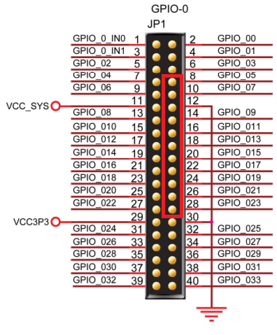
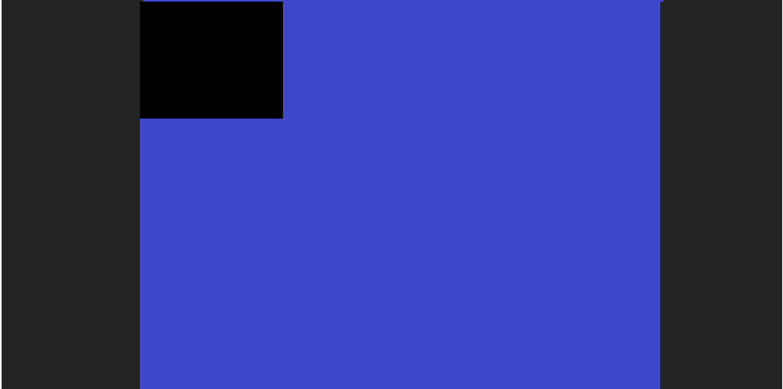
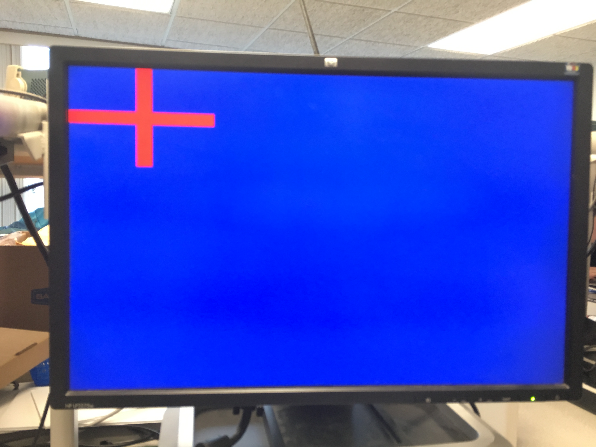
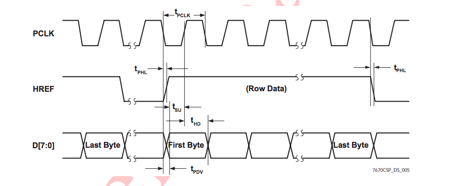
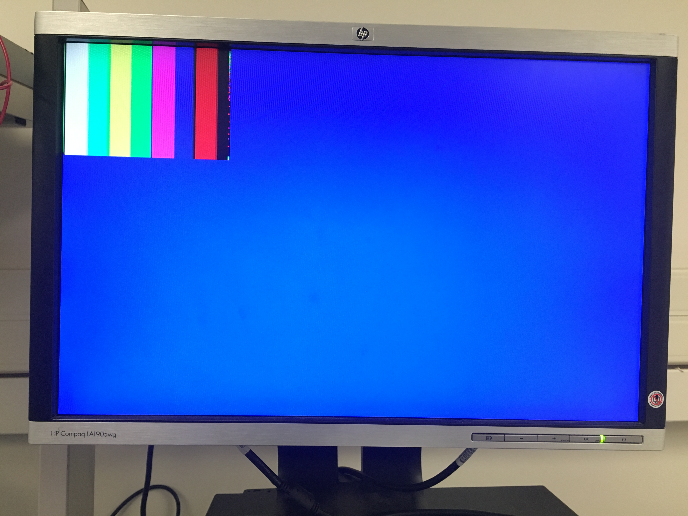
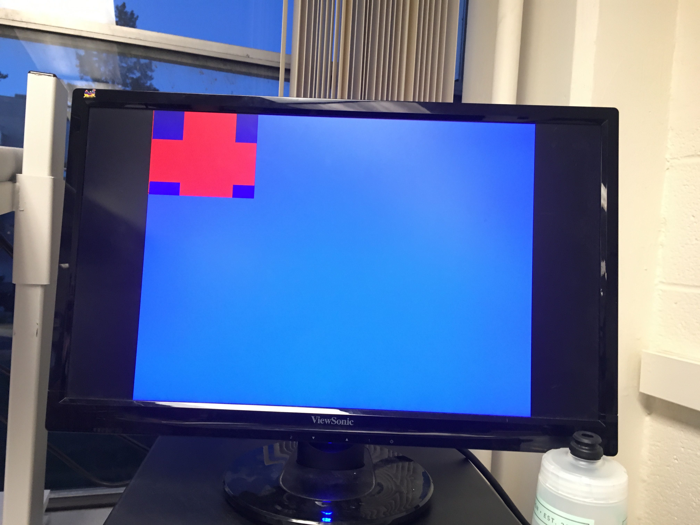
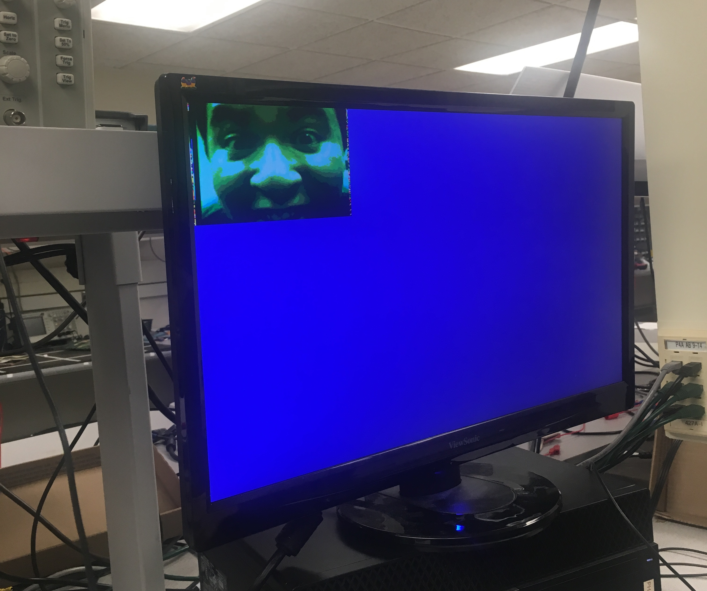

# Lab 4

[Home](./index.md)

## Objective
The purpose of this lab is to begin the process of enabling our robot with computer vision, which will eventually allow it to locate treasures within an arbitrary maze based on sight.  For this week, our team broke off into two groups to tackle the logic and hardware implementation off the robot, so that we could have better control of, and ease of access to, our new system.  This system, at the time of writing, is composed of:

### Materials

* Our Arduino Uno
* Two (2) DE0-Nano - Altera Cyclone IV Field-Programmable Gate Arrays (FPGA)
* CMOS VGA OV7670 Digital Camera
* Pre-built VGA Adapter for FPGA
* Additional Components as Needed

## PLL
With all the different components to drive for this lab, each of which requiring different clock speeds, we needed to setup Phase-Locked Loops on our FPGAs to create a set of 'virtual' clocks.  While our FPGA can generate a 50 MHz internal clock, we need a 24 MHz clock to drive the camera and a 25 MHz clock for the VGA module to drive the screen output for debugging.  Out onboard memory also needs clocks associated with reading and writing data.  So, we created a phase-locked loop (PLL) to generate three clock lines at 24, 25, and 50 MHz, all in phase with each other.  This was accomplished using the _Altera_ IP that is packaged with Quartus II, the environment in which we programmed the FPGA.

We instantiated the PLL within the project's top-level module, _DE0_NANO.v_:

~~~c
jankPLL	jankPLL_inst (
	.inclk0 ( CLOCK_50 ),
	.c0 ( c0_sig ),
	.c1 ( c1_sig ),
	.c2 ( c2_sig )
	);
~~~

Above, c0, c1, and c2 are our 24, 25, and 50 MHz phase-locked clock signals, and c#\_sig are internal wires that can carry our three distinct frequencies.  Note that, while CLOCK_50 can also be used as a 50 MHz line, we use c2\_sig to drive 50 MHz signals instead of CLOCK_50 because our setup ensures that c2\_sig is phase-locked with the other signals.

## Team Arduino

Team Arduino set up the camera registers and communication between the FPGA and the Arduino.

### Writing to Camera Registers

Our first step was to initialize camera registers using information from the OV7670 datasheet. In all, we had to be able to reset all registers, enable scaling, use the external FPGA clock as an internal clock, set the camera to the correct resolution and pixel format, enable a color bar test, and set gain (Automatic Gain Ceiling) parameters on the OV7670.

A table of the addresses of these registers and the values that must be written to them to achieve the above functions as set out in the prelab is shown below:

| Register | Address (Camera) | Value Written (hex) | Additional Comments                                                                                                     |
|----------|------------------|---------------------|-------------------------------------------------------------------------------------------------------------------------|
| COM3     | 0x0C             |  0x08         | Enable scaling |
| COM7     | 0x12             |  0x80 (RESET)     0x0E/0x0C(enable/disable color bar)           | bit 7: Reset all registers  bit 1: Enable color bar test  Setting bit 2 and bit 0 high sets the OV7670 to output RGB data |
| COM15    | 0x40             | 0xD0                | To set camera to RGB444                                                                                                      |
| COM17    | 0x42             | 0x00/0x08(disable/enable colorbar)        | Bit 3: High to enable color bar test (requires two registers)                                                           |
| CLKRC    | 0x11             | 0xC0                | Use external clock (i.e. 24 MHz clock from FPGA)                                                                        |
| MVFP     | 0x1E             | 0x30                | Vertical/Mirror Flip                                                                                                    |
| GFIX     | 0x69             | N/A                 | Setting gain parameters                                                                                                 |
| RGB444   | 0x8C             | 0x02                | Use RGB444 for camera setting                                                                                                         |

Our group was provided with a template function that we used to overwrite the default values at these registers. 

### FPGA-Arduino Communication Protocol

Next, we created a protocol for the FPGA to pass treasure information to the arduino. We set the FPGA to output the treasure shape and color in 4 bits after Team FPGA’s color detection algorithm is run. The first 2 bits will represent the detected treasure’s shape, and the second 2 bits will represent its color.

| Value (bits 1-0) | Color    |
|------------------|----------|
| 00               | None     |
| 01               | Red      |
| 10               | Blue     |
| 11               | Invalid  |

| Value (bits 3-2) | Shape    |
|------------------|----------|
| 00               | None     |
| 01               | Diamond  |
| 10               | Square   |
| 11               | Triangle |

When the Arduino wants treasure information, it will set a digital pin to high and then low for each bit that it wants (4 bits = 4 cycles of high then low). The FPGA will read this signal through a GPIO input pin. The FPGA is set so that it will send 1 bit of the treasure information to the Arduino for each positive edge of this signal. The treasure information is transmitted via a GPIO output pin that the arduino reads through a separate digital pin. This protocol uses 2 Arduino digital pins and 2 FPGA pins. 

FPGA code: 
~~~c
reg [1:0] state = 0;
reg [3:0] treasure;
reg [17:0] counter = 0;
wire arduino_signal;
reg arduino_signal_prev;
assign arduino_signal = GPIO_1_D[32];
always @(posedge c1_sig) begin
		if (arduino_signal == 1 && arduino_signal_prev == 0) begin //manual negedge check
			if (state == 0) treasure = { SHAPE[0],SHAPE[1],RESULT[0], RESULT[1]};
			state = state+1;
		end
		else begin
			state=state;
		end
		arduino_signal_prev = arduino_signal;
end
assign GPIO_0_D[27] = treasure[state]; // write back to arduino
~~~

The Arduino then decodes the 4 bits that it receives and prints out the correct shape and color of the treasure if present, or “None none” is there is no treasure.

## Team FPGA

We attached the VGA adapter to our FPGA at this time.  The pre-made adapter fit neatly over one of the FPGA's GPIO pinouts, occupying pins in the even-numbered sequence from 8 to 28 on GPIO-0, or the odd-numbered sequence of addresses from GPIO_05 to GPIO_023 plus the grounded pin #12 (outlined in red below).

In the top-level module, the clock pins were assigned to each sub-module accordingly.  Specifically, the .CLOCK input for the VGA module was assigned 25 MHz; the .CLK input for the Image Processor module was assigned 25 MHz; the .clk_R (read clock) input for the M9K memory module was assigned 25 MHz, and the .clk_W (write clock) input was assigned 50 MHz.  Thus, all of the modules needed to drive the monitor were instantiated.  The result is shown below.

The black square in the top left corner represents the data stored in our M9K memory blocks, which is currently zeroed.  Our memory array consists of SCREEN_WIDTHxSCREEN_HEIGHT 8-bit registers, where SCREEN_WIDTHxSCREEN_HEIGHT is the product of the two global variables that determine the size of our image output.  For the purposes of this lab, 'SCREEN_WIDTH' is 176 and 'SCREEN_HEIGHT' is 144.  Addresses 0 through 175 hold the pixels corresponding to (0,0) through (0, 175), while the pixel at address (1,0) would be at address 176, and so on.  In order to traverse an array of this size, we need a 15-bit 'r_addr_reg' register.  To explain the blue remainder of the output, it is important to note that the VGA module is still configured to output the full 640x480 resolution.  However, when the values of 'VGA_PIXEL_X' and 'VGA_PIXEL_Y', the two registers that track the location of a given pixel, fall outside the boundary imposed by 'SCREEN_WIDTH' and 'SCREEN_HEIGHT,' the pixel is colored Blue on screen.  

### Memory Buffer

To ensure that our memory buffer is set up correctly, we created a test pattern that could be written into memory and displayed on a screen.  The following code block creates an output resembling the English flag in the top left corner, surrounded by blue:

~~~c
always @ (posedge PCLK) begin
	pixel_data_RGB332[1:0] <= blue;
	pixel_data_RGB332[4:2] <= green;
	pixel_data_RGB332[7:5] <= red;
		W_EN <= 1;
		
		if (((X_ADDR + 10 > `SCREEN_WIDTH / 2) && (X_ADDR - 10 < `SCREEN_WIDTH / 2)) || 
		((Y_ADDR + 10 > `SCREEN_HEIGHT / 2) && (Y_ADDR - 10 < `SCREEN_HEIGHT / 2)) ) begin
			pixel_data_RGB332 <= RED;
		end
		else begin
			pixel_data_RGB332 <= WHITE;
		end
	
		if (X_ADDR == (`SCREEN_WIDTH-1)) begin
			X_ADDR <= 0;
			if (Y_ADDR == (`SCREEN_HEIGHT-1)) begin
				Y_ADDR <= 0;
			end 
			else begin
				Y_ADDR <= Y_ADDR + 1;
			end
		end 
		else begin
			X_ADDR <= X_ADDR + 1;
			Y_ADDR <= Y_ADDR;
		end
end
~~~

After some trial and error, the resulting pattern is shown below:

### Downsampler

Our next step is to create a downsampler to transform the 16-bit RGB444 output of the camera into an 8-bit RGB332 input to the VGA driver. We found experimentally that RGB444 is the most effective for the camera and the downsampler. We are given the camera outputs of HREF and VSYNC, which denote the end of a row of pixels and a frame, respectively, and our goal is to extract the most significant bits corresponding to each color and assign them to the RGB 332 values that will then be displayed on the VGA driver. Since the RGB information is sent over two cycles, we needed to look at the timing diagram in order to determine when best to sample the pixel information.

Using the timing diagram above, we decided to sample the pixel data only when both HREF and PCLK were high, to ensure that we were not overwriting the values with data corresponding to the wrong byte of the 2 byte input. We sampled over two cycles by creating a register called byte_num, which was assigned 0 if the first byte was being read and 1 if the second byte was being read. Once the data over both bytes was aggregated, we wrote W_EN high and allowed the pixel information to be written to memory only after byte_num was made 1 and both bytes were read. 

Since the end of a row is denoted by the falling edge of HREF and the end of a frame is denoted by the rising edge of VSYNC, we created registers to store the last values of HREF and VSYNC in order to find when HREF changws from 1 to 0 and VSYNC changes from 0 to 1. When HREF changes, the x address is reset and the y address is incremented to denote the next row. When VSYNC changes, the x address and y address are both reset to indicate a new frame. The downsampler code is shown below:

~~~c
always @ (posedge PCLK) begin
	temp = {D7, D6, D5, D4, D3, D2, D1, D0};
	if (VSYNC == 1 && lastVSYNC == 0) begin //posedge VSYNC
		X_ADDR = 0;
		Y_ADDR = 0; 
	end
	else if (HREF == 0 && lastHREF ==1) begin
			X_ADDR = 0;
			Y_ADDR = Y_ADDR + 1;
	end
	else begin
		if(HREF && PCLK) begin
			if (~byte_num) begin
				pixel_data_RGB332[7:5] = temp[3:1]; //RGB444
				pixel_data_RGB332[4:0] = pixel_data_RGB332[4:0];
				X_ADDR = X_ADDR;	
			Y_ADDR = Y_ADDR;
				W_EN = 0;      
			end
			else begin 
				pixel_data_RGB332[7:5] = pixel_data_RGB332[7:5]; //RGB444
				pixel_data_RGB332[4:0] =  {temp[7:5], temp[3:2]};
				X_ADDR = X_ADDR + 1;	
				Y_ADDR = Y_ADDR;	
				W_EN = 1;	  
			end
			byte_num = ~byte_num;
		end
		else begin
			X_ADDR=0;
			Y_ADDR = Y_ADDR;
		end
	end
		lastVSYNC = VSYNC;
		lastHREF = HREF;
	
end
~~~
Using this downsampler, we were able to successfully display the color bar test:

### Image Processor

The goal of the image processor module is to determine whether an image is more red or blue and return the result. To determine if there is more red than blue, we first decide if a pixel is blue or red by directly comparing their red and blue values, and taking the larger value to be the dominant color. This code is shown below:

~~~c
if (PIXEL_IN[7:6] > PIXEL_IN[1:0] && PIXEL_IN[7:6] > PIXEL_IN[4:3]) begin
	REDCOUNT = REDCOUNT +16'd1;
	rowCount = rowCount +16'd1;
end
else if (PIXEL_IN[7:6] < PIXEL_IN[1:0] && PIXEL_IN[1:0] > PIXEL_IN[4:3]) begin
	BLUECOUNT = BLUECOUNT +16'd1;
	rowCount = rowCount +16'd1;
end
else begin
	BLUECOUNT = BLUECOUNT;
	REDCOUNT = REDCOUNT;
	rowCount = rowCount;
end
~~~

Then, we sum up the total number of red pixels and the total number of blue pixels and compare the counts. If REDCOUNT is larger than BLUECOUNT, the image is more red than blue, and vice versa for an image that is more blue than red. This comparison is shown below:

~~~c
if (!VGA_VSYNC_NEG && lastSYNC) begin //each frame 
		if (BLUECOUNT >REDCOUNT && BLUECOUNT >16'd25000)begin 
			RESULT = 2'b10;
		end
		else if (REDCOUNT > BLUECOUNT && REDCOUNT > 16'd25000) begin 
			RESULT = 2'b01;
		end
		else begin 
			RESULT = 2'b00;
		end
~~~

## Final Integration
We tested the system as a whole by displaying the camera image on the screen and using LEDs to display the results of the image processor in order to show to functionality of the memory buffer, downsampler, and image processor.

The following video demonstrates color detection. The red LED will light up when the image processor returns a result of red, and the green LED will light up when the image processor returns a result of blue.

<iframe width="560" height="315" src="https://www.youtube.com/embed/WfuxtL3I-Fc" frameborder="0" allow="accelerometer; autoplay; encrypted-media; gyroscope; picture-in-picture" allowfullscreen></iframe>

The video below demonstrates the communication of treasure information between the FPGA and Arduino: 

<iframe width="560" height="315" src="https://www.youtube.com/embed/4qbswV10Brk" frameborder="0" allow="accelerometer; autoplay; encrypted-media; gyroscope; picture-in-picture" allowfullscreen></iframe>

## Bonus Content :)

Here's a failed attempt of our English flag for your viewing pleasure:

Here is Michael getting up close and personal with our camera. Truly dedicated to this lab.

