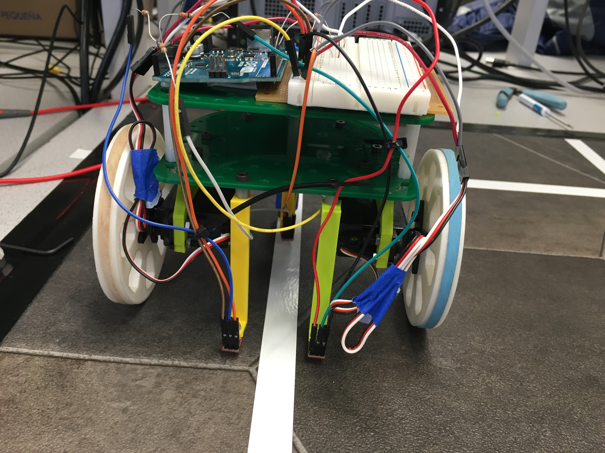

# Milestone 1
[Home](./index.md)

## Goals

The purpose of this milestone was to design a motion control system for our robot.

The tasks we set out to complete included:
  * Getting our robot to successfully follow a line
  * Getting our robot to successfully traverse a grid in a figure eight.
  
Additionally, we focused on: 
  * Developing a robust control system, and
  * Getting our robot to complete these tasks at a reasonably high speed
    
## Materials    

The only materials used for this milestone that weren't used in lab one were 3 QTR-1A reflectance sensors ([datasheet here](https://www.pololu.com/product/958)). 

These sensors have three pins, VIN, GND, and OUT. Each sensor outputs a voltage at its OUT pin that corresponds with the lightness or darkness of the surface below it. 

In our setup, the OUT pin of each sensor is tied to a separate analog input of the Arduino Uno controlling our robot. As such, each of these analog inputs will read in a value between 0 and 1023 corresponding to the lightness or darkness of the area under it.
## Line Following

We equipped our robot with two line sensors in its front, designed to be far enough apart to straddle a line of electrical tape (see image below). 



Our line following code is written with three cases in mind: 
* If the robot detects that neither of its sensors are on the line, it will drive straight
* If the robot detects that its left sensor is on the line, it will veer left to correct course
* If the robot detects that its right sensor is on the line, it will veer right to correct courses 

A snippet of this code is shown below
(Please note: Our line-following code is written under the assumption that our robot will follow a grid of white tape on a black background. The threshold sensor values (300 in this case) will change under different circumstances.)

```c
//Case: traveling along line --> drive straight
if (sensor_values[0] > 300 && sensor_values[1] > 300) { drive_straight();}

//Case: drifting off to the right --> correct left
else if (sensor_values[0] < 300) { veer_left(); }

//Case: drifting off to the left --> correct right
else if (sensor_values[1] < 300) { veer_right(); }
```

Some code from the helper functions ```drive_straight()```, and ```veer_left()``` is shown below. 


```drive_straight()``` sets both wheels to rotate in the forward direction at a moderate speed.
```c
void drive_straight(){
  servoL.write(95);
  servoR.write(85);     
}
```

```veer_left()``` increases the speed of the right wheelrelative to its speed set by ```drive_straight()```, and rotates the left wheel backward. ```veer_right()``` is defined nearly identically to ```veer_left()```.
```c
void veer_left(){
  servoL.write(80);
  servoR.write(55);
}
```

## Figure Eight
