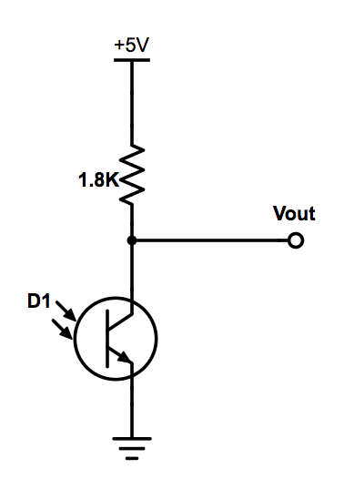
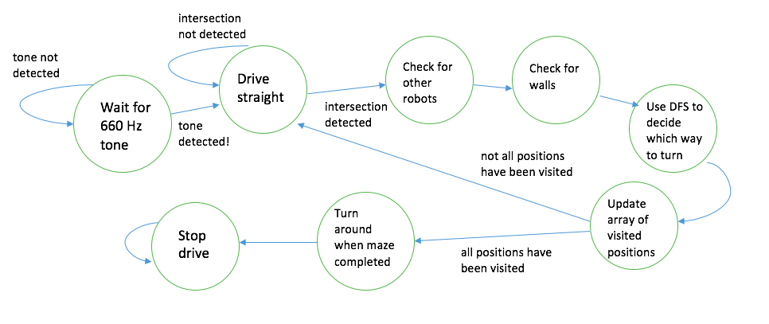

# Final Robot Design

[Home](./index.md)

## Introduction:
Over the course of the past semester, we were tasked with constructing an Intelligent Physical System (IPS) that could autonomously and successfully navigate an arbitrary maze while recording information about its surroundings and reporting this information to an external base station.

To qualify as an IPS, our robot had to (1) perceive its environment, (2) reason about the information it collected, and (3) act upon its environment. Our system fulfilled these requirements in the following ways:

1. Using an array of microphone, IR, wall, and line sensors, our robot was able to take in information about its environment.
2. With the gathered information, the robot uses algorithms like the fast Fourier transform (FFT) and depth-first search (DFS) to detect obstacles and accurately traverse its way through the maze.
3. By reasoning about this information, our robot was able determine how to progress through the maze and map additional squares.

Generally, our system aimed to accomplish the following tasks:

* Detect and start on a 660 Hz tone
* Detect a 6 KHz IR transmission from another robot and avoid it
* Detect and avoid walls
* Follow and traverse the gridlines of the maze
* Record and transmit information about walls and positionality to a base station


## Physical Design:
We reconstructed our FFT-amplifier circuit, adding additional pin headers to make testing and verification of functionality easier. The extra pin headers also allowed us to replace broken components easily. Our FFT-amplifier circuitry contains our IR and microphone circuits, as both require an FFT. As the microphone is only used at the beginning of the competition, we added a multiplexer to reduce the number of analog inputs we used on our Arduino, which deselects the microphone circuit and selects the IR circuit after the 660 Hz tone initiates operation. The layouts for both these circuits is shown below:

 

The output of each of these circuits was fed into an LM358 op-amp in an inverting configuration (as shown below). A resistive voltage divider was used to bias the non-inverting terminal of each such op-amp to 2.5V (half of the supply voltage provided by the Arduino) in order to preserve the signal’s shape.


The above circuits were wired to one of the analog inputs on our Arduino. Below is the entire pinout of our Arduino:

| Pin       | Use                                |
| --------- | ---------------------------------- |
| A0        | Left line sensor                   |
| A1        | Right line sensor                  |
| A2        | Center line sensor                 |
| A3        | Front wall sensor                  |
| A4        | Left/right wall sensor             |
| A5        | Audio/IR output                    |
| 0, 1, 2   | Unused                             |
| 3         | Left servo control signal          |
| 4         | Serial communication with camera   |
| 5         | Right servo control signal         |
| 6         | Wall sensor mux select bit         |
| 7         | FFT mux select bit                 |
| 8         | Serial communication with camera   |
| 9-13      | Nordic Radio                       |
| SDA, SCL  | I2C protocol for camera            |

As shown in the table above, we also have a multiplexed input for our left and right wall sensors. This circuit, in addition to the audio/IR circuit and a breadboard is located on our robot’s bottom plate. On its top plate are three wall sensors and an IR transmission hat.


On the bottom of our robot, we attached servos and line sensors. Additionally, we have our two battery packs - one to power the arduino and one to power the servos - velcroed to the bottom plate, so that they are secure and easy to swap out between runs. In the back, we added a mounted ball bearing that is designed to roll on the ground while our robot moves.


Had we elected to use our camera and FPGA, we would have attached the camera to the front of the robot next to our front wall sensor. Our breadboard would have had enough space to wire all of the camera connections. The FPGA would have been attached to the top plate of our robot in the back. We chose not to include these two components in our final design however, since we were concerned about the reliability of our camera connection and image quality for determining treasure shape and color. Since we did not want to lose points for incorrectly identified treasures, we strategically chose to not integrate the treasure detection aspect.


Our final design is shown below:


## Code Design:
Our code is broken into two modes within an overall loop. The first is a listening phase which continually waits for a 660 Hz input or a push button input. The second is a movement and transmission phase which processes the various sensor inputs, and uses these to map and catalog the maze. These phases are generally described by the diagram below and will be expanded upon in the subsequent sections.



### Movement:
The movement block emcompasses how the robot progresses from one intersection to the next. This process requires line following, intersection detection, and turning. All of these sub-processes depend on the three line sensors mounted to the face of the robot. The major challenge of developing these processes was calibrating the sensitivity of our line sensors as we modified the structure of our robot.


Our robot’s wheels were controlled using Parallax Continuous Rotation servos. Using Arduino’s built-in servo library, we were able to control the rotation speed by first declaring the servos to be attached to a specific digital output pin and then writing a PWM signal to the servo. The servo library allows us to adjust the duty cycle of this PWM signal (and thus, the speed and direction of the wheel’s rotation) by writing a value between 0 to 180 to a given servo. 

```
void drive_straight() {
  servoL.write(95+loffset);
  servoR.write(85);
  get_line_values();
}
```

### Line Following:
Our robot uses QRE1113 line sensors in order to detect the grid on the floor of the maze. These sensors output a voltage between 0V and the supply voltage corresponding to the darkness of the surface under them. These voltages are then binned into an array of length 1024. Lower output voltages correspond with lighter surfaces, and higher output voltages correspond with darker surfaces. We read the output voltages from three of these line sensors into three of our Arduino’s analog inputs, and compare them to a predetermined threshold value stored locally. To achieve line following, we use the outer two sensors to detect when our robot strays too far to the left or right. Based on these inputs we are able to effectively course correct using a variety of helper functions designed to make the appropriate adjustments. To facilitate this process, we create a helper method line_follow_until_intersection() that steers the robot in the event that it veers off of the line, and brings the robot to a stop when a junction is detected.

```
if (sensor_values[0] < line_threshold && sensor_values[1] < line_threshold ) { //INTERSECTION
      stop_drive();
      if (!IR_detect()) {//if no robot is detected
        Serial.println(F("NO ROBOT DETECTED"));
        return;
      }
      else{
        Serial.println(F("ROBOT DETECTED"));
        delay(5000);
      }
      }
    //Case: traveling along line --> drive straight
    else if (sensor_values[0] > line_threshold && sensor_values[1] > line_threshold ) {
      drive_straight_lf();
    }

    //Case: drifting off to the right --> correct left
    else if (sensor_values[0] < line_threshold ) {
      veer_left();
    }
```
### Wall Detection
Each time our robot travels to a new, unvisited intersection, the get_wall_values() method is called, which records the values detected by our IR wall sensors, and compares the values to our predetermined threshold value to determine the presence of walls on three sides. As mentioned above, we have multiplexed our left- and right-hand wall sensors to the same analog input A4, so our method must select the left-hand sensor input before updating the respective global variable, and then select the right-hand sensor input to do the same.

| Sensor                    | Threshold Value |
| ------------------------- | --------------- |
| Line Sensors              | 300             |
| Long Range Wall Sensors   | 355             |
| Short Range Wall Sensors  | 170             |


### Junction Detection and Turning
A junction is detected when all three line sensors detect a line during forward movement, as opposed to only a single line sensor detecting a line, indicating that the robot has veered off course. When the robot reaches a junction, it will decide which direction it will go based on the location of walls surrounding the junction and map traversal algorithms (discussed below). In doing so, the robot will either turn_left(), turn_right(), or do neither before calling line_follow_until_intersection() once more. The robot may also turn_around() to backtrack if it works itself into a deadend (walls on each side). We checked for other robots at every intersection and after each turn with FFT, telling our robot to stop if it detected another robot until it stopped detecting said robot (FFT discussed later).

### DFS

We implemented a depth-first search algorithm to efficiently traverse an arbitrary maze in a limited amount of time using limited onboard memory. The final implementation of this algorithm is recursive, and will continuously operate until the entire maze has been traversed. Starting from a corner, the robot calls the dfs method, which reads the wall sensor values at the beginning junction and determines which directions are able to be traversed before selecting one, continuing to the next junction, and calling the dfs method again. This pattern continues until the robot has driven itself into a corner (a junction surrounded by three walls), at which point it will turn around and backtrack to the previous position before returning the function.

Example DFS Implementation:


### FFT:
Our robot is designed to be capable of detecting 660 Hz audio signals and 6.08 KHz IR signals. In our final design, either the output of a microphone (i.e. an audio signal) or the output of a circuit driven by a phototransistor (i.e. an IR signal) is referenced to our arduino’s A5 analog input pin. When desired, our robot will compute the FFT of the signal at this input using openmusiclabs’ arduino FFT library. For each FFT computation, the robot takes 128 discrete samples of the voltage at this input at a sampling rate of either:
1. Approximately 2 KHz when detecting audio signals
2. 76.875 KHz (the Arduino’s clock frequency of 16 MHz, divided by the 13 cycles required to compute an analogRead() as well as by the value set as the ADC prescalar (16 in our system).

We achieve this adjustment of sampling frequencies by delaying for 500 us after each 13 us analogRead() when sampling an audio signal. By using the arduino to control the selection bit of a multiplexer into which we input both of these signals, we can select both the type of signal present at A5, as well as the sampling frequency.
After sampling, the FFT of this sampled signal is computed, and its outputs are scaled logarithmically.


### Microphone:
We elected not to add any filtering to our previously discussed microphone circuit. Rather we ran the output through an inverting amplifier and performed an FFT on the output. A 660 Hz signal with ambient interference would produce an FFT plot similar to the one shown below.


As seen above the 660 Hz signal causes a distinct peak in a specific range. Within our listening phase we polled that specific bin of the FFT until that bin had a value above a specific threshold for ten consecutive cycles.

```
if (fft_log_out[43] > 75) {
      Serial.println(F("660 Hz Detected"));
      servoL.attach(3);
      servoR.attach(5);
      servoL.write(90);
      servoR.write(90);
      start =1; 
       ADCSRA &= ~(bit (ADPS0) | bit (ADPS1) | bit (ADPS2)); // clear prescaler bits
      ADCSRA |= bit (ADPS0) | bit (ADPS1) | bit (ADPS2);
      return;
    }
```

### IR:
Similar to the microphone, we didn’t implement any filtering on our IR detection circuit, opting to run the output through an inverting amplifier. We performed an FFT on the output, looking in a specific index of the FFT output array to check if a 6.08kHz signal was detected. For this circuit, the FFT index and threshold value differed from the microphone circuit, as shown below.


### Radio Transmission:
We used nrfL01 radios in our implementation as well as the RF24 library.

#### Encoding:
At each intersection, our robot records the cardinal directions of the walls present at that intersection, the shapes and colors of any treasure at that intersection, and its position in the maze in raster coordinates. This information is transmitted to the Base Station as a sequence of 32 bits via radio transmission. Considering the 32 bits in 4 bytes, the first of these bytes encodes this wall information. Bits 3:0 of this first byte encode the aforementioned information about the presence (or lack thereof) of walls surrounding the robot, each of these bits representing a wall in a given direction. The second two bytes encode the shape and color of any treasure, with bits 3:0 of byte 2 representing treasure information at the north wall, bits 7:4 of byte 2 representing treasure information at the east wall, bits 3:0 of byte 3 representing treasure information at the south wall, and bits 7:4 of byte 3 representing treasure information at the west wall. Finally, the fourth of these bytes encodes the robot’s raster position in the maze, an integer value between 0 and 80.

#### Transmission:
On the robot side, the value of each of the four bytes to be transmitted is computed. These values are written into an unsigned long (a 32-bit data type), and sent to the base station using the RF24 radio library’s radio.write() function. The robot transmits, and waits for the base station to communicate whether the transmitted value was received. If it receives a response, it resumes its traversal of the maze. Otherwise, it waits for 1 second and attempts to transmit again. In order to ensure that each transmission is successful on the robot’s end, the robot will continue to transmit the same information until the radio.write() function returns the value of true.

#### Receiving:
On the base station side, the transmitted value from the robot is read and saved into an array using the RF24 radio library’s radio.read() function. When the data is received successfully, the base station transmits back to the robot to confirm that the data was received.

### GUI:
The data received by the base station Arduino is parsed and decoded using our decipher function. This function first parses the 32-bit unsigned long, and using the bitRead() function built in to Arduino, copies the information into an int array containing either 1 or 0 corresponding to the value of each bit in the byte array. This ensures that each element can be accessed in constant time and improves readability of the code by remaining consistent with the devised encoding scheme. This function will then decode the wall information examining the first four elements of the array, and decodes treasure information using elements 8-23 simply by determining whether a 1 or 0 is found at each element. The fourth byte, containing position information in raster coordinates is decomposed into the corresponding x and y coordinates using the height and width of the maze. Every time the base station receives a payload, it prints this information to the serial in the format required by the GUI.

```
if (data_array[3] == 1) {
    north = "true";
  }
  else {
    north = "false";
  }

  if (data_array[2] == 1) {
    east = "true";
  }
  else {
    east = "false";
  }

  if (data_array[1] == 1) {
    south = "true";
  }
  else {
    south = "false";
  }

  if (data_array[0] == 1) {
    west = "true";
  }
  else {
    west = "false";
  }
  bool treasure_exists = !(!data_array[8] && !data_array[9] && 
    !data_array[12] && !data_array[13] && !data_array[16] && !data_array[17]
    && !data_array[20] && !data_array[21]);
  int wall = 5;
  if (treasure_exists) {
    for (int k = 0; k < 4; k++) {
      if(data_array[8 + 4*k] || data_array[9 + 4*k] || 
      data_array[10 + 4*k] || data_array[11 + 4*k]) {
          wall = k; // wall stores the wall at which the treasure is placed.
        }
    }
```

The GUI reads the Serial output of the base station and displays the information received on a graphic representation of the maze in order to provide a visual representation of the robot’s progress. The relevant information the GUI takes is the following: x position; y position; presence of a wall on the north, east, west and south sides of the robot; if a treasure is at a given position; the shape and color of the treasure; and whether another robot is detected. The GUI displaying wall information is shown below. In the spirit of good design choices, we also chose to change the unexplored image on the GUI from the Cornell University logo to a much more beautiful image of our group member, Ben, taken on our robot’s camera in its early stages.


### Image Processing:
For the majority of our image processing module, there were few creative decisions to make outside of interpreting the data stored in onboard memory. From this data, we needed to interpret the color and shape of the detected image, if one was present at all. Our memory block features a 176x144 array of bytes, each of which contains the RGB444 data taken in by the camera and subsequently compressed by our FPGA into an RGB332 format able to be displayed by the VGA driver and displayed to a screen for debugging. Utilizing the camera input signals PCLK (determines the speed at which camera data is sent), HREF (indicates the end of a row of pixels), and VSYNC (indicates the end of an image frame), we were able to downsample the 16 bit camera input over two cycles into an 8-bit input to the VGA driver.

~~~c
always @ (posedge PCLK) begin
	temp = {D7, D6, D5, D4, D3, D2, D1, D0};
	if (VSYNC == 1 && lastVSYNC == 0) begin //posedge VSYNC
		X_ADDR = 0;
		Y_ADDR = 0; 
	end
	else if (HREF == 0 && lastHREF ==1) begin
			X_ADDR = 0;
			Y_ADDR = Y_ADDR + 1;
	end
	else begin
		if(HREF && PCLK) begin
			if (~byte_num) begin
				pixel_data_RGB332[7:5] = temp[3:1]; //RGB444
				pixel_data_RGB332[4:0] = pixel_data_RGB332[4:0];
				X_ADDR = X_ADDR;	
			Y_ADDR = Y_ADDR;
				W_EN = 0;      
			end
			else begin 
				pixel_data_RGB332[7:5] = pixel_data_RGB332[7:5]; //RGB444
				pixel_data_RGB332[4:0] =  {temp[7:5], temp[3:2]};
				X_ADDR = X_ADDR + 1;	
				Y_ADDR = Y_ADDR;	
				W_EN = 1;	  
			end
			byte_num = ~byte_num;
		end
		else begin
			X_ADDR=0;
			Y_ADDR = Y_ADDR;
		end
	end
		lastVSYNC = VSYNC;
		lastHREF = HREF;
	
end
~~~

In order to determine whether an image was either majority red or majority blue, we chose to sum up the number of blue and red pixels in an image, and directly compare the two to determine this. In order to ensure we were not doing this color processing when there is not a treasure available, we set a minimum pixel threshold for both red and blue. For shape processing, we use this color result and compare the amount of either red or blue pixels in each row and detect patterns in the way this value changes. If the amount of red or blue pixels steadily increases between rows, the shape is likely a triangle; if the amount stays roughly constant, the shape is likely a square; if the amount ever decreases appreciably between rows then the shape is likely a diamond.

~~~c
if (PIXEL_IN[7:6] > PIXEL_IN[1:0] && PIXEL_IN[7:6] > PIXEL_IN[4:3]) begin
	REDCOUNT = REDCOUNT +16'd1;
	rowCount = rowCount +16'd1;
end
else if (PIXEL_IN[7:6] < PIXEL_IN[1:0] && PIXEL_IN[1:0] > PIXEL_IN[4:3]) begin
	BLUECOUNT = BLUECOUNT +16'd1;
	rowCount = rowCount +16'd1;
end
else begin
	BLUECOUNT = BLUECOUNT;
	REDCOUNT = REDCOUNT;
	rowCount = rowCount;
end
~~~

~~~c
		if (VGA_PIXEL_X == 10'b0  && rowCount > 15'd50 && VGA_PIXEL_Y < 144*2/3) begin //new row
			count = count - 3'b001;
			if (count == 3'b0) begin
				if (lastRowCount+16'd7 < rowCount) begin
					TEMP_SHAPE = 2'b11; // triangle
				end
				else if (lastRowCount-16'd15 > rowCount) begin
					TEMP_SHAPE = 2'b01; // diamond
				end
				else begin
					TEMP_SHAPE = 2'b10; // square
				end
				count = 3'b101;
			lastRowCount = rowCount;
			end
			rowCount  = 16'd0;
~~~

We then devised a serial I2C protocol to communicate this treasure information from the FPGA to the Arduino, to then be transmitted to the base station Arduino and output to the GUI. This protocol involved the Arduino writing a designated input pin to the FPGA high when it was ready to receive information, and the FPGA writing a designated pin on the Arduino high or low depending on the treasure output. This is performed serially over 4 iterations to get all color and shape information in a given image.

## Budget:

| Part                      | Threshold Value | Unit Cost    |
| ------------------------- | --------------- | ------------ |
| Line Sensors              | 3               | $3           |
| IR Sensors                | 3               | $7           |
| Servo                     | 2               | $13          |
| Arduino Uno               | 1               | $16          |
| Camera                    | 1               | $14          |
| nrfL01 radio              | 1               | ~$1          |
| LM358 (Op amo)            | 1               | ~$1          |
| OP598 (phototransistor)   | 1               | ~$0.50       |
| Electrec Microphone       | 1               | ~$0.70       |
| CD74HC Mux                | 2               | ~$0.70       |

Total: $90.6
*does not include cost of FPGA and arduino and radio on the base station receiving robot transmissions
(~ means cost found based off of Google and mouser, and are mostly approximations)

## Results and Conclusions:
This semester we were able to build a robot that follow lines, detect walls, and transmit to our GUI. We learned about image processing, FFT applications, and communication protocols, and along the way, how to work together as a team.

Unfortunately, our robot did not perform well at the final competition. Both our IR circuit and our front and right wall sensors broke on the last day of testing, and limited equipment and limited time prevented us from fixing the robot completely for the final competition. For this reason, we also resorted to long range IR. If given the chance to redo this robot, we would have bought our own line and wall sensors, and CAD-ed a chassis so that the parts fit together better, since we did have some mechanical difficulties during the semester. 
